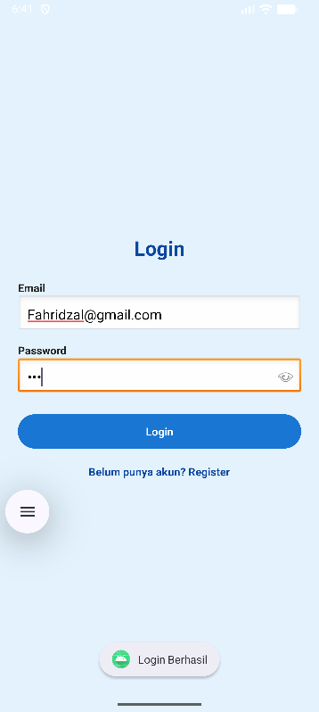
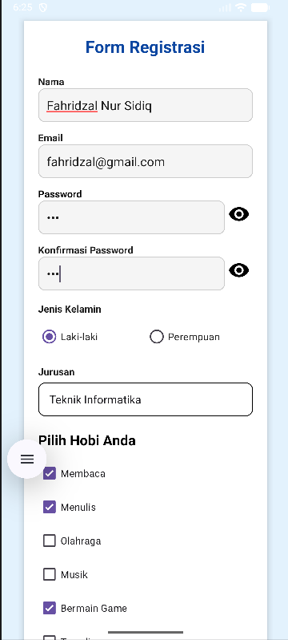
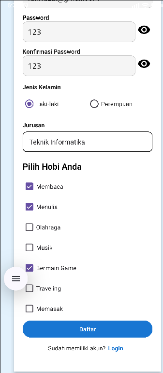
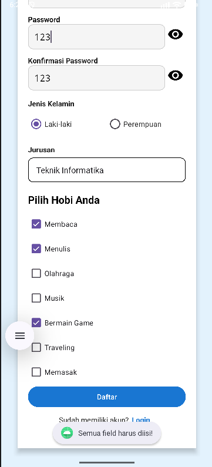
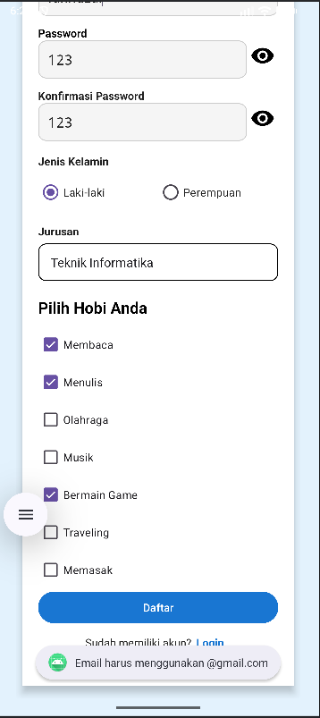
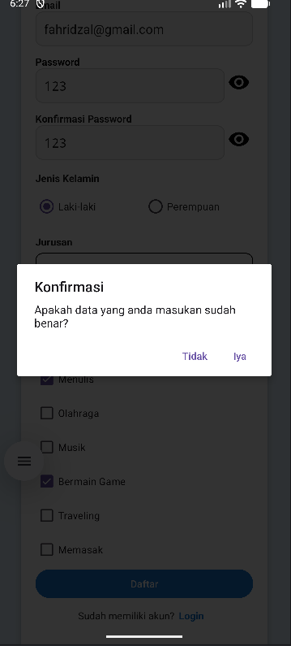
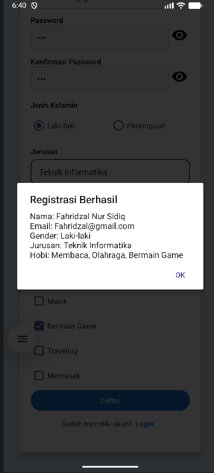

Tugas Pemrograman 1
Membuat Layout Authentication Form
Nama: Fahridzal Nur Sidiq
Kelas: TIF RP 24 D CNS

---

Deskripsi
Pada tugas ini, saya membuat layout Authentication Form yang terdiri dari beberapa tampilan, yaitu:
Halaman Login
Halaman Login Berhasil
Halaman Register
Pop-up Login & Register
Pop-up Konfirmasi & Data berhasil Di inputkan

Aplikasi ini berfokus pada pembuatan tampilan (UI layout) menggunakan konsep dasar pemrograman web.

---

Demo Aplikasi
Berikut demo tampilan dari aplikasi yang telah dibuat:

Halaman Login

Halaman Register

Halaman Register

Notifikasi semua field wajib di isi

Menggunakan Format @gmail.com

Popup Konfirmasi Data

Popup Data Berhasil di Inputkan

